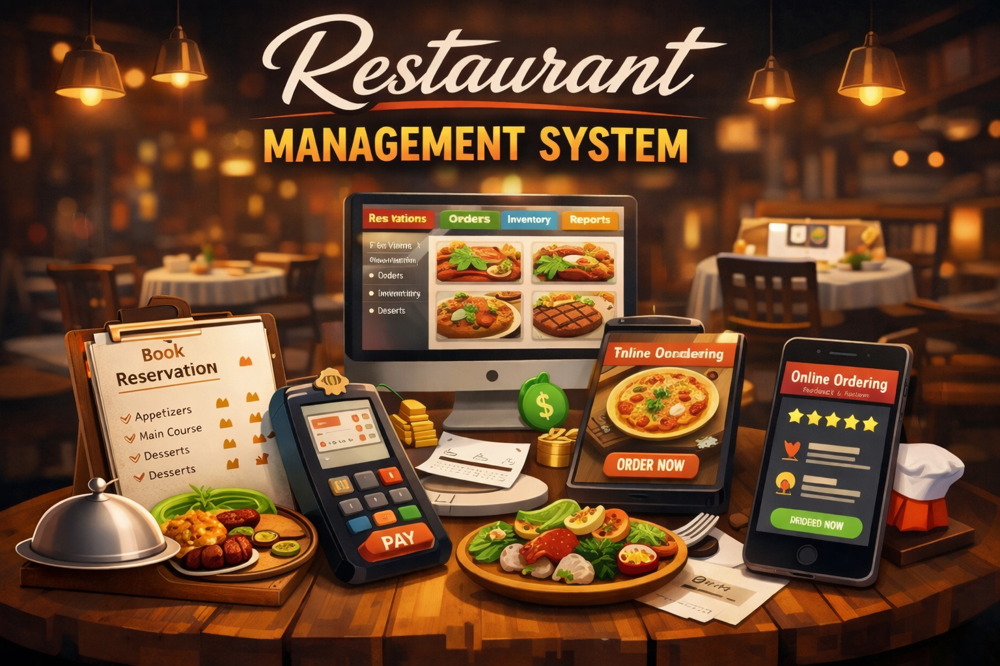

<h1 align="center">🍽️ Restaurant Management System</h1>

  

<h3 align="center">A Console-Based C Application for Efficient Restaurant Operations</h3>

  
  
  

---

## 📖 Overview  

The **Restaurant Management System** is a **console-based application developed in C** designed to streamline and manage core restaurant operations efficiently.  

It provides a structured and user-friendly system for handling essential tasks such as menu display, order processing, reservations, and billing.

---

## 🚀 Features  

### 📋 Menu Management  
- Display menu items with pricing in a structured format  
- Easy updates and modifications  

### 🛒 Order Processing  
- Place new orders  
- Modify or cancel existing orders  
- Dynamic order handling  

### 📅 Reservation System  
- Book tables with date and time management  
- Organized reservation tracking  

### 💰 Billing System  
- Automatic bill calculation  
- Discount handling  
- Receipt generation  

---

## 🛠️ Tech Stack  

- **Language:** C Programming  
- **Paradigm:** Procedural Programming  
- **Storage:** File Handling  
- **Platform:** Console-Based Application  

---

## ⚙️ Key Highlights  

- Modular and clean function-based architecture  
- Persistent data storage using file handling  
- Efficient input validation system  
- Easy-to-use console interface  

---
